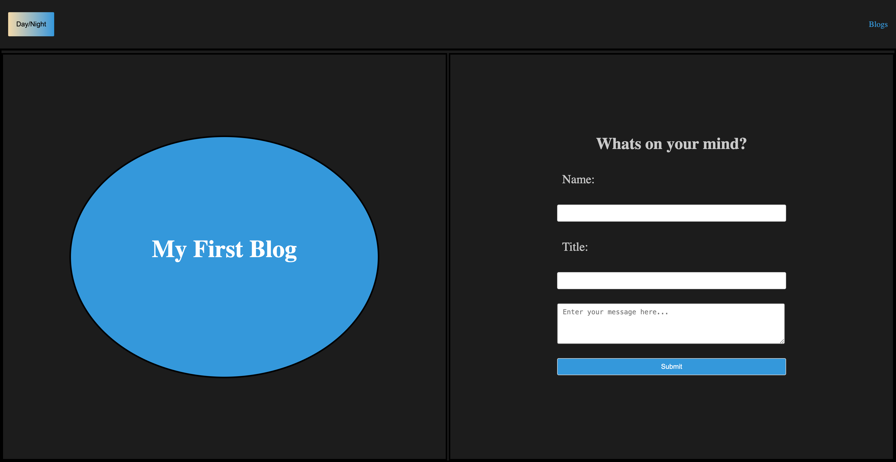

BLOG APP

## Description

a lightweight and easy-to-use web application designed for writers and bloggers who want to share their thoughts with the world. This application provides an intuitive interface for creating, posting, and managing blog entries. Whether you're looking to start a personal blog or create a space for community discussions, making it easy to get your ideas online.

## Visuals

## Deployment

([LIVE_LINK](https://vgalante2.github.io/Personal-Blog/))

## Usage

To use the webpage, you can review each section by clicking on the header links at the top of the page. To inspect each element, you can open the Chrome DevTools by pressing Command+Option+I (macOS) or Control+Shift+I (Windows). A console panel should open either below or to the side of the webpage in the browser. There you can navigate to the Accessibility tab to highlight each picture element,

## Credits

JD Tadlock for helping me understand concepts

## License

MIT License.
